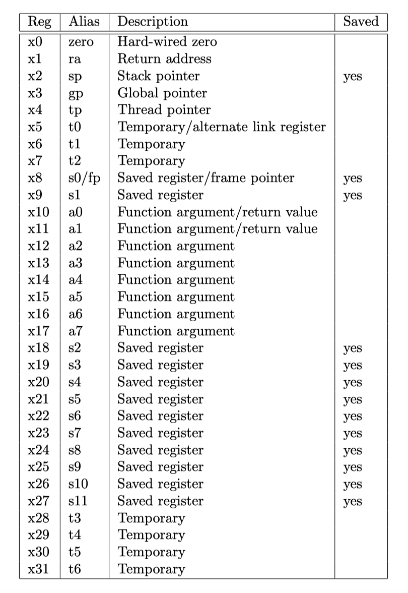
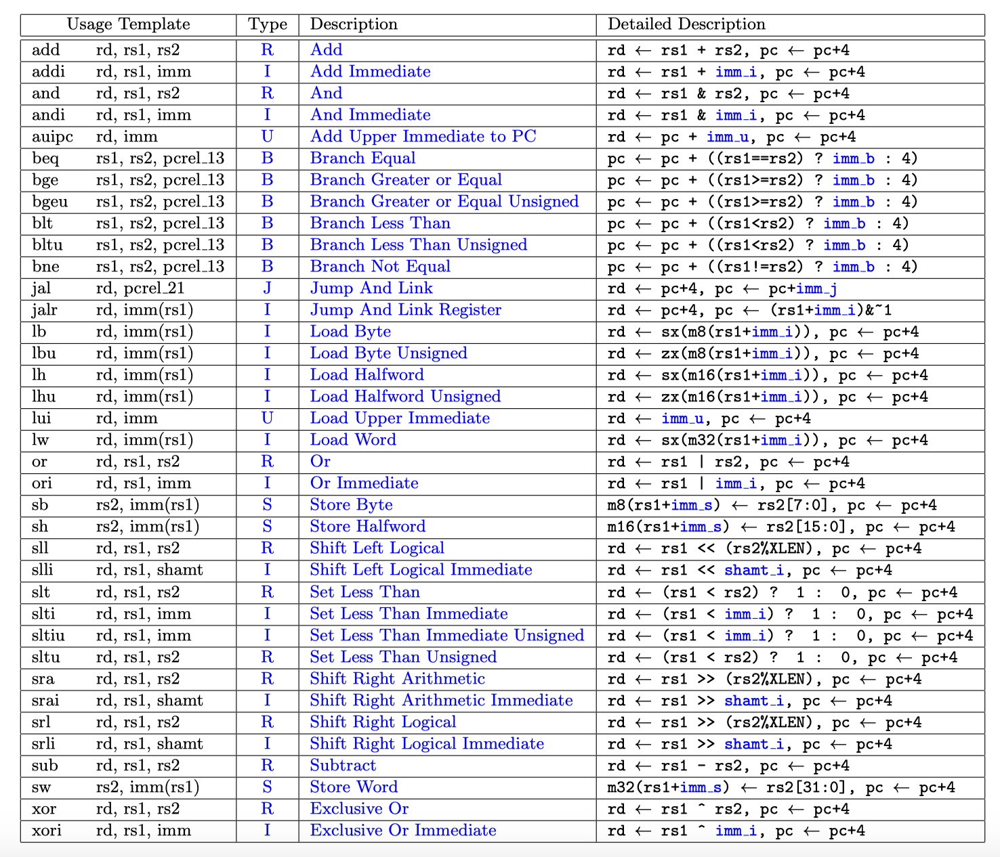
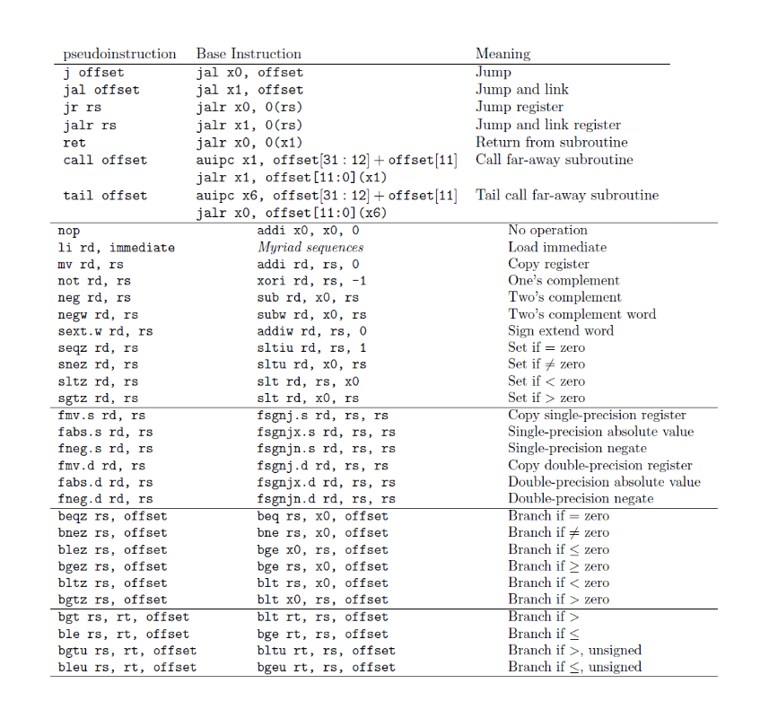
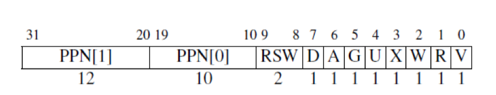
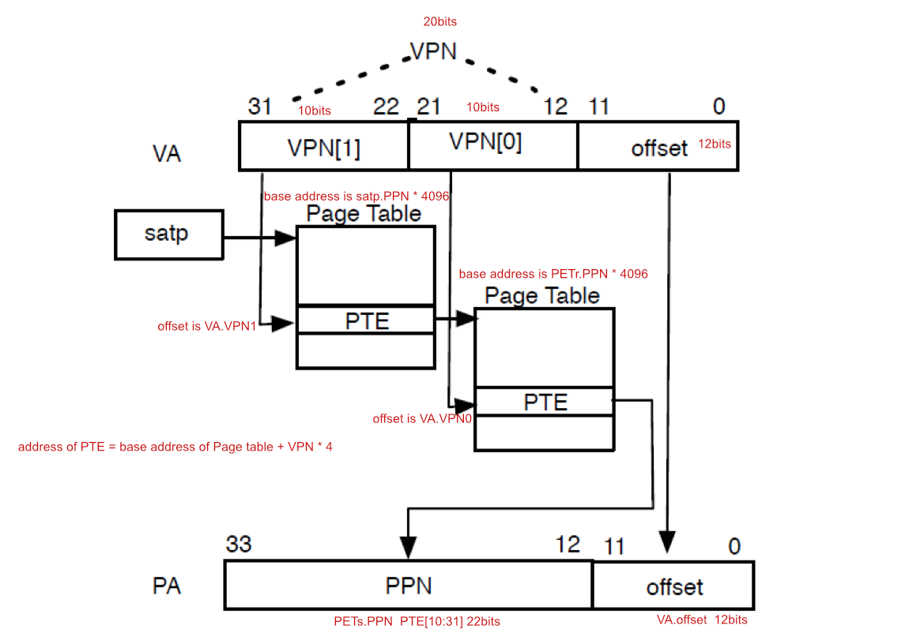

# Reference

## Registers

## RV32I Reference Card

## RV32 Sv32 Page Table Entry

## RV32 `satp` CSR

- Mode:
    - `0` (Bare) - No translation or protection
    - `1` (Sv32) - Page-based 32-bit virtual addressing.

## RV32 Sv32 Address Translation

- `PPN`: Physical Page Number
- `VPN`: Virtual Page Number

- `satp` `PPN` is the PPN of the base address of root page table with 4KiB unit.
- `VPN` of a virtual address has 10 bits. (1024 pages at most). Virtual address has two VPNs.
- Sv32 has only 1 root page table and 1024 secondary page tables at maximum.
- Each page table has 1024 PTEs (Page Table Entry).
- Virtual address has 32 bits (4GiB), while Physical address has 34 bits (16GiB).

Address calculation:
- base address of root page table: `satp.PPN * 4046`
- base address of a secondary page table: `satp.PPN * 4046 + VPN * 4`